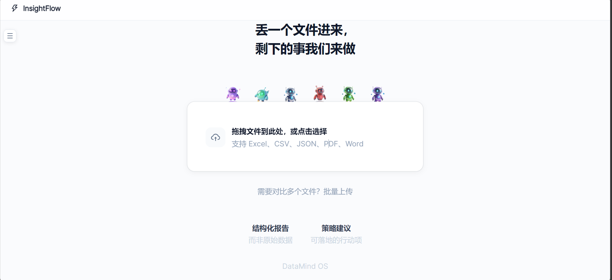
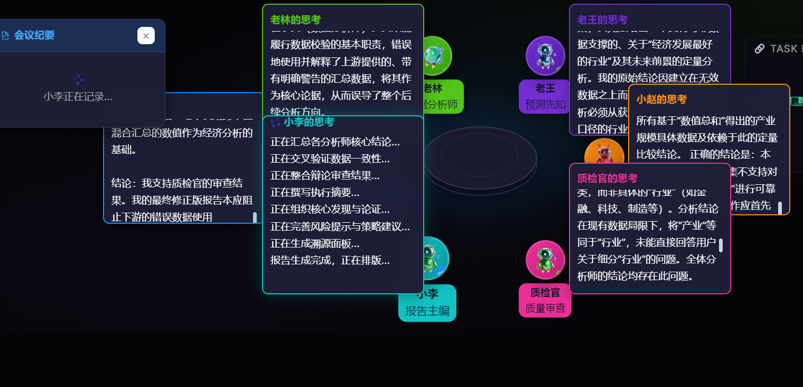
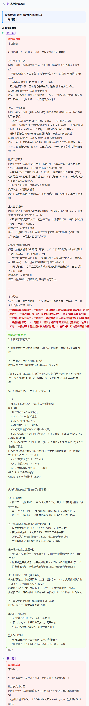

# InsightFlow

一个用自然语言做数据分析的BI平台。上传CSV，用中文提问，多个AI智能体会自动协作分析，然后给你出一份带图表的报告。

## 效果





## 它是怎么工作的

用户提一个问题 -> 主管AI把问题拆成多个子任务 -> 任务池按依赖关系调度 -> 各Agent并行执行 -> 质检官审查结果（会质疑和辩论）-> 报告主编汇总输出

```
用户: "分析某问题，比如前沿行业，"
        │
   ┌────▼────┐
   │ 主管AI  │ ← 任务分解
   └────┬────┘
        │
   ┌────▼────────────────┐
   │      任务池(DAG)      │ ← 按依赖关系调度
   │  ┌──┐  ┌──┐  ┌──┐  │
   │  │T1├─►│T2├─►│T3│  │
   │  └──┘  └──┘  └──┘  │
   └────────┬────────────┘
            │
   ┌────────▼────────────┐
   │   六智能体并行执行     │
   │ 老陈(数据) 老林(分析)  │
   │ 老王(预测) 小赵(策略)  │
   └────────┬────────────┘
            │
   ┌────────▼────────────┐
   │   质检官 + 辩论审查   │ ← 对抗性质控
   └────────┬────────────┘
            │
   ┌────────▼────────────┐
   │   小李: 专业报告生成  │ ← 麦肯锡式结构
   └─────────────────────┘
```

## 技术栈

**后端**
- Python 3.7+ / FastAPI / Uvicorn
- DuckDB (OLAP内存数据库)
- DeepSeek API (兼容OpenAI接口)
- SSE (Server-Sent Events) 流式通信
- 可选 Redis 分布式任务池

**前端**
- React 18 / TypeScript
- Vite / Ant Design / TailwindCSS
- ECharts (图表)
- Three.js + Verlet物理引擎 (圆桌动画)

## 项目结构

```
backend/
  src/
    main.py                     # FastAPI入口 + 中间件
    core/
      duckdb_engine.py           # DuckDB引擎 (51KB，查询+文件解析)
      memory.py                  # SQLite多轮对话记忆
    insightflow/
      orchestrator.py            # 核心调度器 (DAG任务编排)
      supervisor.py              # 主管AI (任务分解)
      task_pool.py               # 任务池 (DAG依赖调度)
      debate.py                  # 对抗性辩论框架
      guard.py                   # 质检官 (规则+LLM混合质控)
      chen.py                    # 老陈 - 数据工程师
      lin.py                     # 老林 - 数据分析师
      wang.py                    # 老王 - 预测师
      zhao.py                    # 小赵 - 策略顾问
      li.py                      # 小李 - 报告主编
      nl2sql.py                  # 自然语言转SQL
      agent_memory.py            # Agent自进化记忆
      redis_backend.py           # Redis分布式后端(可选)
      session_store.py           # Session持久化
      conversation_manager.py    # 多轮对话管理
    utils/
      llm_client.py              # LLM客户端 (DeepSeek/OpenAI)
    api/routers/
      insightflow.py             # SSE流式端点
      data.py                    # 数据上传/查询
      settings.py                # 配置管理

frontend/
  src/
    pages/
      InsightFlow.tsx            # 主分析页面
      InsightFlow/
        Roundtable.tsx           # 圆桌讨论 (Verlet物理引擎)
        TaskDAG.tsx              # DAG任务可视化
        CinematicReport.tsx      # 专业报告渲染
        ProvenancePanel.tsx      # 溯源面板
      Dashboard.tsx              # 仪表盘
      DataExplorer.tsx           # 数据浏览
      Login.tsx                  # 登录
    components/
      analysis/                  # 图表组件 (ECharts)
      layout/                    # 导航栏 + 侧边栏
    store/appStore.ts            # Zustand全局状态
```

## 快速开始

### 1. 后端

```bash
cd backend

# 安装依赖
pip install -r requirements.txt

# 配置API Key
cp .env.example .env
# 编辑 .env，填入你的 DeepSeek API Key

# 启动
python -m uvicorn src.main:app --reload --port 8001
```

### 2. 前端

```bash
cd frontend

npm install
npm run dev
```

打开 http://localhost:3000

## 核心设计决策

**为什么不用 LangChain？**

这个项目的Agent协作逻辑比较特殊——需要DAG依赖调度、对抗性辩论、任务修正回退。LangChain的Agent抽象更适合单Agent+工具调用的场景，套上来反而限制表达。所以核心调度逻辑自己写的，LLM调用层只是一个薄封装。

**为什么用 DuckDB 而不是 PostgreSQL？**

BI场景下查询是读多写少，DuckDB的列式存储在聚合查询上比PG快很多，而且零部署（嵌入式）。缺点是不支持并发写入，但数据分析场景基本不需要。

**为什么质检官用规则+LLM混合？**

纯规则引擎能快速发现"没有数据来源"、"结论太模糊"这类问题，成本低速度快。但有些逻辑矛盾和上下文不一致的问题规则看不出来，这时候才用LLM做深度审查。按数据复杂度自动选择，简单数据规则够用就省一次API调用。

## License

MIT
